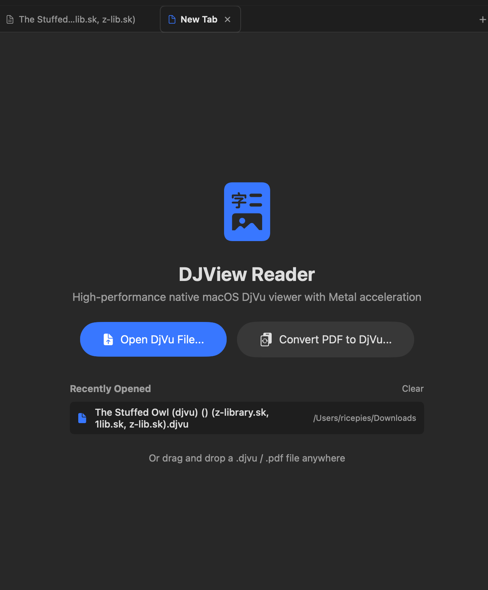
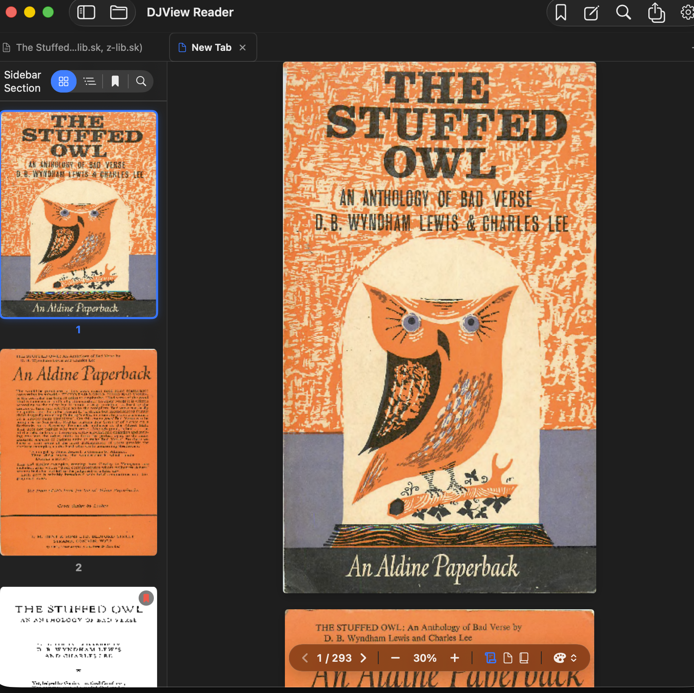
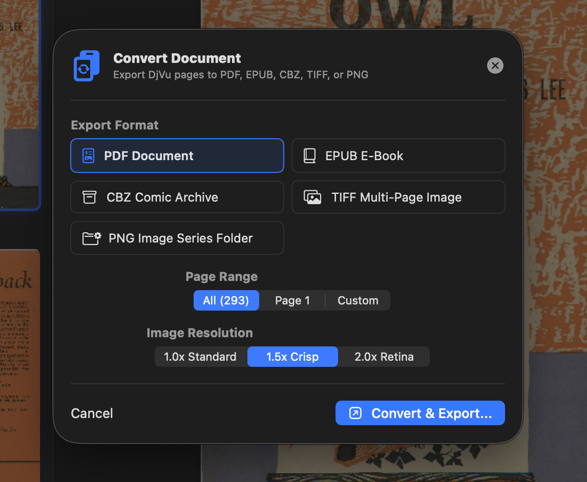

# DJView — Native macOS DjVu Reader

<p align="center">
  
</p>

**DJView** is a high-performance, fully native macOS DjVu document viewer built with a **pure Rust core** and a **SwiftUI + Metal** frontend. It renders DjVu documents faster than any cross-platform solution, with zero dependency on DjVuLibre or any C/C++ runtime.

> **macOS 14 Sonoma or later required.**

---

## Screenshots

<p align="center">
  
</p>

<p align="center">
  
</p>

---

## Features

| | |
|---|---|
| 📄 **Multi-Tab** | Open multiple documents simultaneously in browser-style tabs (`Cmd+T`) |
| ⚡ **Metal Rendering** | GPU-accelerated page display via MTKView — 0% idle GPU usage |
| 📜 **Continuous Scroll** | Smooth vertical scrolling with lazy off-screen prefetch |
| 📖 **Manga Mode** | Right-to-left dual-page layout for comics and manga |
| 🔍 **Full-Text Search** | OCR-backed search with bounding-box match highlighting |
| 🎨 **Layer & Shader Controls** | Switch DjVu layers (Color / FG / BG / Mask) + Metal color shaders (Invert, Sepia, Grayscale, High Contrast) |
| 🖼️ **Thumbnail Sidebar** | Instant page previews, table of contents, bookmarks, notes, search results |
| ✏️ **Page Notes** | Multi-note drawer per page, persisted per document |
| 📑 **Bookmarks** | One-tap page bookmarking (`Cmd+D`), persisted across sessions |
| 💾 **Export** | Convert whole document to **PDF, EPUB, CBZ, TIFF, or PNG series** in background |
| 🔁 **PDF → DjVu** | Convert PDF files to DjVu format with JB2 compression |
| 🧠 **State Persistence** | Remembers last page, zoom, layout, sidebar tab, layer, and shader per document |

---

## Download

**[⬇ Download DJView.dmg](https://github.com/YOUR_USERNAME/djview/releases/latest)**

Drag `DJView.app` into `/Applications` to install. No additional runtime required.

---

## Building from Source

### Prerequisites

| Tool | Version |
|---|---|
| macOS | 14.0 Sonoma or later |
| Xcode Command Line Tools | 15+ |
| Swift | 5.9+ |
| Rust + Cargo | 1.75+ |

Install Rust: `curl --proto '=https' --tlsv1.2 -sSf https://sh.rustup.rs | sh`

### Build

```bash
git clone https://github.com/YOUR_USERNAME/djview.git
cd djview
./scripts/build.sh
open DJView.app
```

### Release DMG

```bash
./scripts/create_dmg.sh
# → DJView.dmg
```

---

## Architecture

```
djview/
├── djvu-bridge/          # Rust static library (C FFI over djvu-rs)
│   ├── src/lib.rs        # FFI surface — decode, render, search, export
│   └── include/          # C header for Swift bridging
└── DJView/               # Native macOS Swift app
    └── Sources/DJView/
        ├── DJViewApp.swift          # App entry, TabManager wiring
        ├── TabManager.swift         # Multi-tab state
        ├── TabBarView.swift         # Chrome-style tab bar UI
        ├── TabbedDocumentView.swift # Root tab container
        ├── MainView.swift           # Per-tab window layout
        ├── AppViewModel.swift       # Document state & export logic
        ├── DjVuEngine.swift         # Swift ↔ Rust FFI bridge + LRU cache
        ├── CanvasViews.swift        # Continuous / Single / Manga canvas
        ├── MetalRenderer.swift      # MTKView + Metal shaders
        ├── MetalPageView.swift      # SwiftUI wrapper for MTKView
        ├── SidebarViews.swift       # Thumbnail, TOC, bookmarks, search
        ├── Overlays.swift           # Annotation & text-selection overlay
        └── Models.swift             # Value types (SearchResult, TextZone…)
```

See [ARCHITECTURE.md](ARCHITECTURE.md) for the full technical deep-dive.

---

## Keyboard Shortcuts

| Action | Shortcut |
|---|---|
| Open file | `Cmd+O` |
| New tab | `Cmd+T` |
| Close tab | `Cmd+W` |
| Next / previous tab | `Ctrl+Tab` / `Ctrl+Shift+Tab` |
| Toggle sidebar | `Cmd+Shift+S` |
| Search | `Cmd+F` |
| Bookmark page | `Cmd+D` |
| Toggle note drawer | `Cmd+Shift+N` |
| Export / Convert | `Cmd+Shift+E` |
| Zoom in / out / reset | `Cmd+=` / `Cmd+-` / `Cmd+0` |
| Layout: Continuous / Single / Manga | `Cmd+1` / `Cmd+2` / `Cmd+3` |
| Previous / next page | `←` / `→` |

---

## Contributing

See [CONTRIBUTING.md](CONTRIBUTING.md).

---

## License

**DJView Strong Copyleft License v1.0** — see [LICENSE](LICENSE).

All Derivative Works must remain open source under the same license.
No trademark, subscription, or other legal mechanism may be used to restrict
redistribution of compiled binaries. Network/SaaS deployments must publish
full source code. This closes the [Red Hat loophole](https://en.wikipedia.org/wiki/Red_Hat#CentOS_controversy) explicitly.
